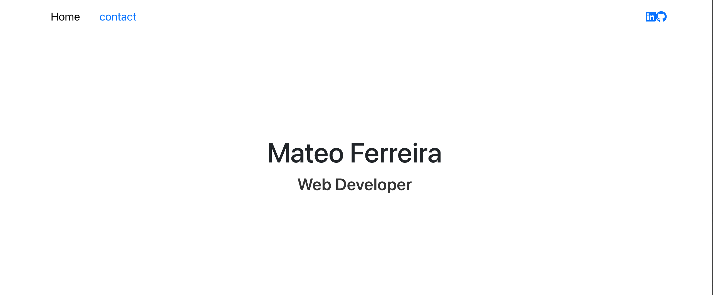
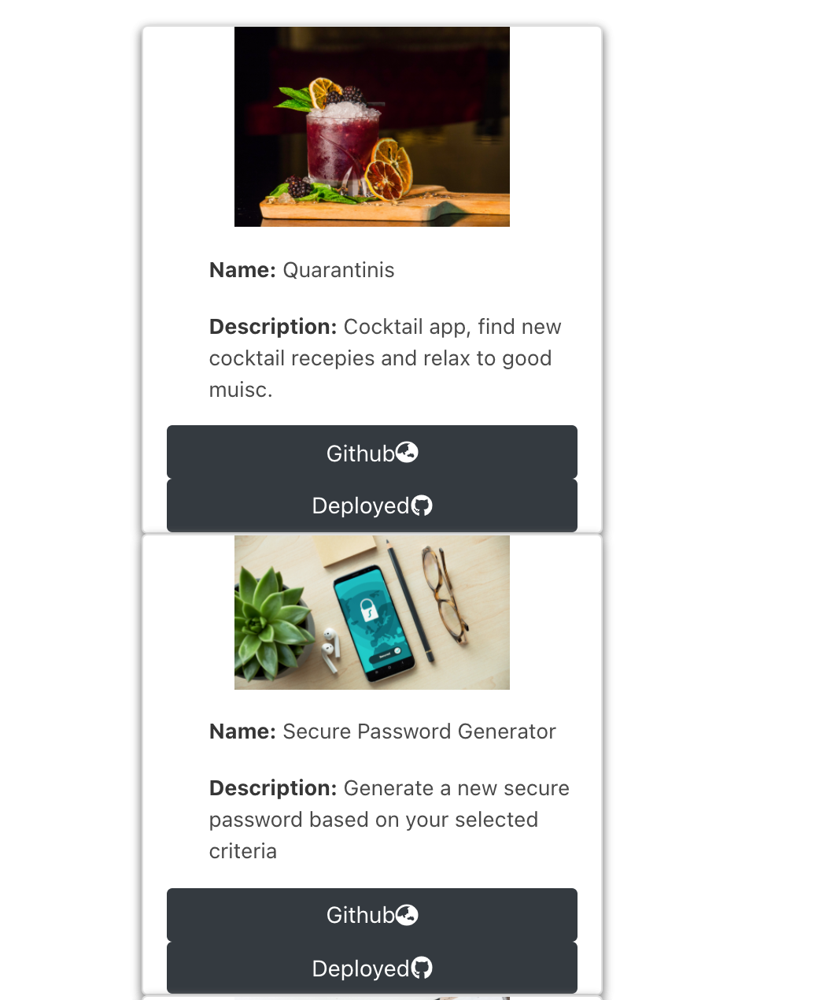
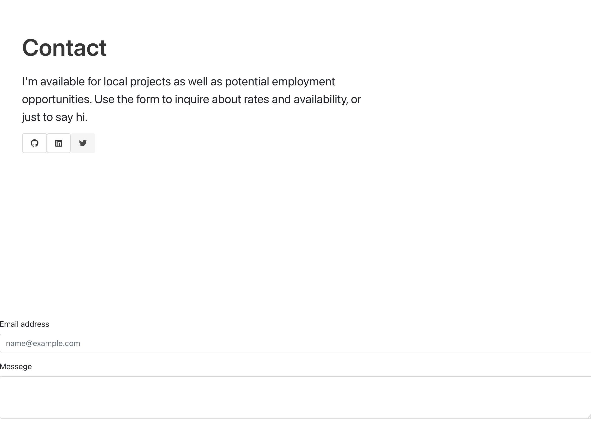

#  React Portfolio 

## Description
Updated New react portfolio 

 App: https://mf948.github.io/Mf948/react-portfolio
 Github: https://github.com/Mf948/react-portfolio
## Table of contents

 
[Installation](#installation) 
[Technology used](#technology) 
[Deploying the App](#Deploying)
[License](#License)  

## technology used:
React.js Html css Bootstarp
## Installation
no prior Intstallation required
Run NPM to install dependecies

## Deploying 
 not need to deploy app, use the link to run or git clone and happy coding
## Questions
 Contact me 
EMAIL: Xferreiramat@gmail.com
## License
Content in this project is governed under the MIT License.

To read the license in its entirety, click here: [MIT](./LICENSE)

---

Copyright [2021] [Mateo Ferreira]
